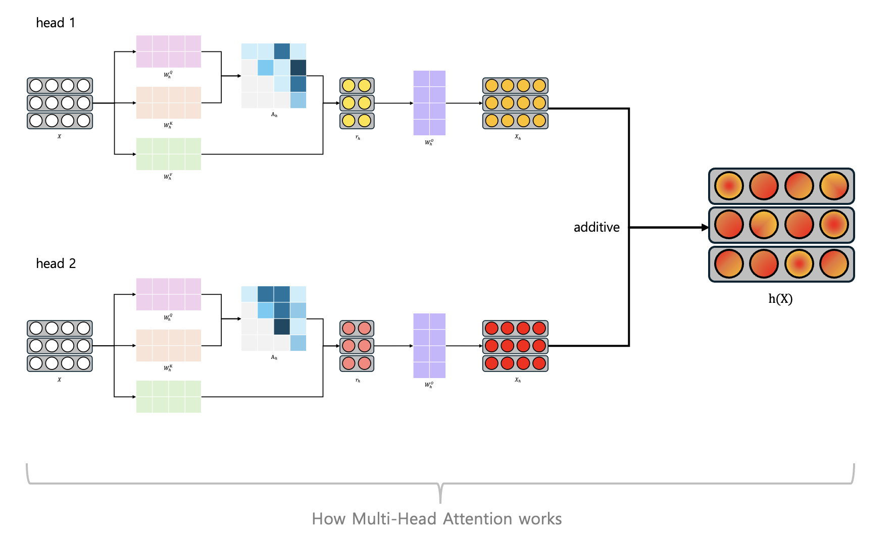

# head-bang-bang-project
> **Eng** : This repository contains the complete Head Bang Bang project and tracks our progress. Our goal is to identify which specific roles are performed in each head and to develop an algorithm that can clearly highlight those results.

> **Kor** : Head Bang Bang(HBB) 프로젝트의 과정과 내용을 기록하는 저장소입니다. 우리의 목표는 각 attention head가 수행하는 역할을 찾거나 특정 주제와 강하게 연관된 attention head를 식별하고, 그 결과를 명확하게 드러낼 수 있는 알고리즘을 개발하는 것입니다.

## 0. Introduction
[A Mathematical Framework for Transformer Circuits - Anthropic](https://github.com/yongukpark/head-bang-bang-project.git)

위 논문은 **Attention heads are Independent and Additive**라고 말한다. 즉 여러 attention head가 각각 독립적인 역할을 하는 주체로 해석할 수 있다는 것이다. 

$$W_O^{H}
\begin{bmatrix}
r^{h_1} \\
r^{h_2} \\
\vdots
\end{bmatrix} =\left[ W_O^{h_1},\, W_O^{h_2},\, \cdots \right]
\begin{bmatrix}
r^{h_1} \\
r^{h_2} \\
\vdots
\end{bmatrix} = \sum_u W_O^{h_i}r^{h_i}$$

$r_i$는 i번 attention head의 출력으로 보고 다음과 같이 additive하게 residual stream에 전달된다.

예를 들어, 10번째 layer에서
- Head 1 → 역할 A 수행
- Head 2 → 역할 B 수행

한다고 가정해보자.

각 attention head는 서로 다른 기능을 수행하지만, 최종적으로 residual stream에 더해지면 
- 각 head의 기여도가 합쳐지면서 개별 역할이 명확하게 보이지 않을 수 있다
- 여러 head의 신호가 섞이며 의미가 희석될 수 있다
- 그 결과 실제 역할과 다르게 해석될 가능성이 존재한다

따라서 본 프로젝트는 attention head를 개별적으로 분리하여 분석하고 각 head가 수행하는 역할을 식별하고 그 결과를 **누가 보더라도** 결과를 명확하게 드러낼 수 있는 알고리즘을 개발하는 것을 목표로 하고 있다.