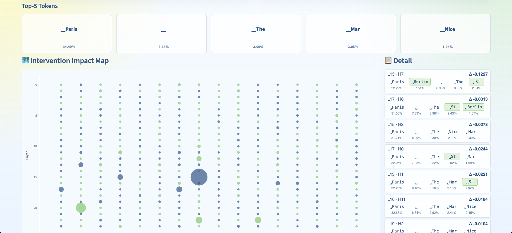
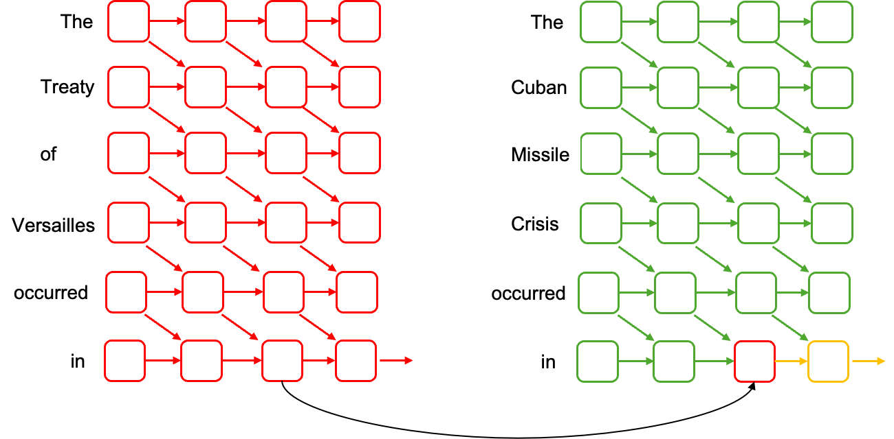
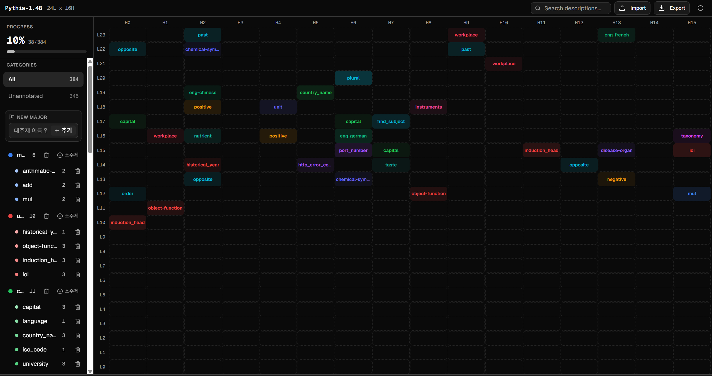

# head-bang-bang-project
> **Eng** : This repository contains the complete Head Bang Bang project and tracks our progress. Our goal is to identify which specific roles are performed in each head and to develop an algorithm that can clearly highlight those results.

> **Kor** : Head Bang Bang(HBB) 프로젝트의 과정과 내용을 기록하는 저장소입니다. 우리의 목표는 각 attention head가 수행하는 역할을 찾거나 특정 주제와 강하게 연관된 attention head를 식별하고, 그 결과를 명확하게 드러낼 수 있는 알고리즘을 개발하는 것입니다.

## Project Lineup
- **HeadScope**: head 개입 기반 탐색 실험의 출발점
- **HeadPatcher**: patching 실험의 자동화와 지표 집계 파이프라인
- **HeadAtlas**: 결과 탐색/정리 워크스페이스

## 0. Introduction
[A Mathematical Framework for Transformer Circuits - Anthropic](https://transformer-circuits.pub/2021/framework/index.html)

위 논문은 **Attention heads are Independent and Additive**라고 말한다. 즉 여러 attention head가 각각 독립적인 역할을 하는 주체로 해석할 수 있다는 것이다. 

$$W_O^{H}
\begin{bmatrix}
r^{h_1} \\
r^{h_2} \\
\vdots
\end{bmatrix} =\left[ W_O^{h_1},\, W_O^{h_2},\, \cdots \right]
\begin{bmatrix}
r^{h_1} \\
r^{h_2} \\
\vdots
\end{bmatrix} = \sum_u W_O^{h_i}r^{h_i}$$

$r_i$는 i번 attention head의 출력으로 보고 다음과 같이 additive하게 residual stream에 전달된다.

예를 들어, 10번째 layer에서
- Head 1 → 역할 A 수행
- Head 2 → 역할 B 수행

한다고 가정해보자.

각 attention head는 서로 다른 기능을 수행하지만, 최종적으로 residual stream에 더해지면 
- 각 head의 기여도가 합쳐지면서 개별 역할이 명확하게 보이지 않을 수 있다
- 여러 head의 신호가 섞이며 의미가 희석될 수 있다
- 그 결과 실제 역할과 다르게 해석될 가능성이 존재한다

따라서 본 프로젝트는 attention head를 개별적으로 분리하여 분석하고 각 head가 수행하는 역할을 식별하고 그 결과를 **누가 보더라도** 결과를 명확하게 드러낼 수 있는 알고리즘을 개발하는 것을 목표로 하고 있다.

## 1. [HeadScope](https://github.com/yongukpark/HeadScope)
HeadScope는 transformer의 attention head에 직접 개입해 보면서, 어떤 head가 특정 지식이나 출력 패턴에 영향을 주는지 살펴보기 위한 실험 도구입니다. 단일 head 실험부터 multi-head 조합, 구조적 해석, 반복 검증까지 한 흐름으로 확인할 수 있습니다.

head에 직접 개입하여 결과를 흔들어 보며 변화의 양상을 확인할 수 있는 시각적 실험 환경을 제공합니다.

## 2. [HeadPatcher](https://github.com/yongukpark/HeadPatcher)
HeadScope가 개별 실험의 변화 양상을 빠르게 확인하고 실험에 대한 감각을 잡는데에 초점을 두었다면, HeadPatcher는 그 과정을 더 많은 프롬프트와 head에 대해 반복 가능하게 확장하기 위해 나온 분석 파이프라인입니다. 눈으로 확인한 패턴을 수치로 누적하고 비교할 수 있도록, 프롬프트 단위/헤드 단위 지표를 체계적으로 저장하는 역할을 맡습니다.
- 실험에 사용할 데이터셋을 생성
- 전체 head 스캔 및 특정 head 세트 평가를 CLI로 실행
- 결과를 CSV/JSONL로 저장해 재현성과 비교 가능성 확보
- 카테고리 단위 데이터셋을 기반으로 안정적인 영향 head 후보 추출

핵심 지표와 실행 예시는 [HeadPatcher README](https://github.com/yongukpark/HeadPatcher/blob/main/README.md)를 참고합니다.

실험 방식은 last token의 특정 head을 patching하는 방식을 사용하였고

이를 통해 donor token의 logit이 올라가고 base token의 logit이 떨어지는지를 주로 확인하였습니다.

## 3. [HeadAtlas](https://github.com/yongukpark/HeadAtlas)
HeadAtlas는 누적된 결과를 시각적으로 탐색하고 정리하기 위한 인터페이스입니다.
분석 결과를 빠르게 훑고 공유 가능한 형태로 다듬는 단계에 초점을 둡니다. 또한 시각화를 통해 특정 헤드의 역할을 찾는 것에 대한 추가적인 인사이트가 있는 것을 기대하고 있습니다.

## 4. Future Work
현재는 단 1개의 방식(patching) 방식을 통해 특정 head의 역할을 규명할 수 있다는 가능성을 보았습니다. 하지만 해석을 위한 결과는 생각하는 것 만큼 명확한 답변을 주지 않았습니다. 예를들어 특정 token을 200등에서 1등으로 올리는 것을 목표로 한다면 현재 200등에서 100등으로 올라오는 것까지만 확인할 수 있었습니다.

HeadPatcher에서 구축한 데이터셋을 동일하게 가져와 역할을 더 잘 보여줄 수 있는 다른 알고리즘을 찾는 것을 목표로 하여 여러 알고리즘을 비교할 수 있는 파이프라인 구축을 목표로 합니다.
